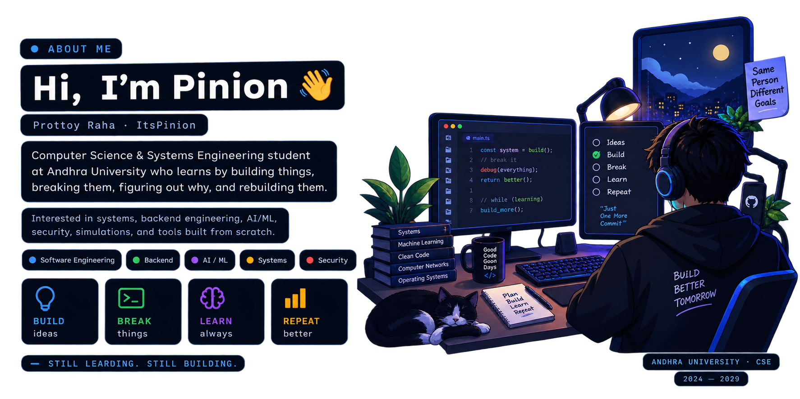

# Hi there, I'm Pinion (Prottoy Raha) 👋

### Computer Science & Systems Engineering Student · Developer · Builder

  
# About Me 👀

  

I'm **Prottoy Raha**, but I usually go by **Pinion** online (`ItsPinion`).

I'm a **Computer Science & Systems Engineering student at Andhra University** who spends a probably unreasonable amount of time building things just to figure out how they work.

These days, I'm much more interested in understanding systems communicate, how software is structured, where things break, and why they break in the first place.

Most of what I learn comes from building. I'll get an idea, start making it, run into something I don't understand, spend way too long debugging it, and eventually come out knowing something I didn't know before.

`Software Engineering` · `Backend` · `AI/ML` · `Systems` · `Security`

I don't really enjoy learning something just to memorize it. If I can build it, break it, debug it, and rebuild it, I'll probably understand it a lot better.

Outside of the usual coding stuff, I enjoy **hackathons, simulations, experimenting with weird ideas, and making small tools that solve problems I actually have**.

Still learning. Still breaking things. Still building.

## Languages & Tools 🛠️

<!-- Languages -->

 

<!-- Frontend -->

 

<!-- Databases -->

 

<!-- AI / ML -->

 

<!-- Development & Infrastructure -->

 

<!-- Development Environment -->

## Contribution Streak 🔥

  

## Contribution Graph 🐍

  <picture>
    <source
      media="(prefers-color-scheme: dark)"
      srcset="./github-snake-dark.svg"
    />
    <source
      media="(prefers-color-scheme: light)"
      srcset="./github-snake.svg"
    />
    
  </picture>

---

## Random Developer Wisdom 💭

  

## Connect 🌐

  
  &nbsp;
  
  &nbsp;
  
  &nbsp;
  
  &nbsp;
  

  

---

### Build it. Break it. Understand it.

